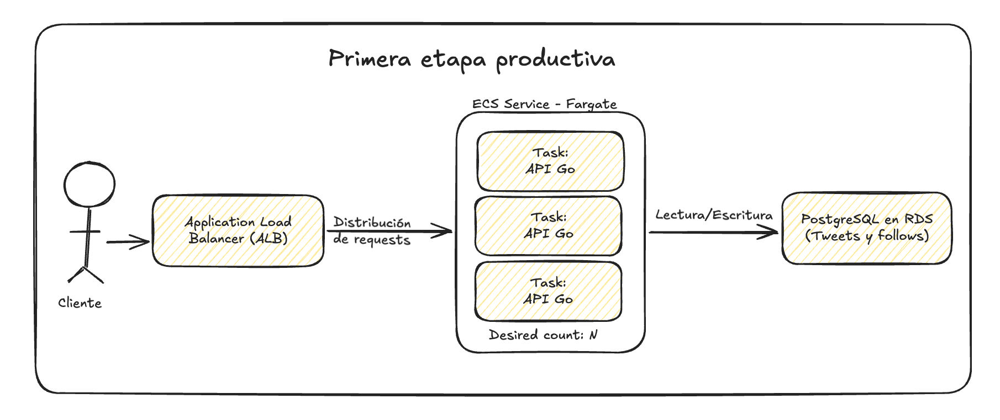
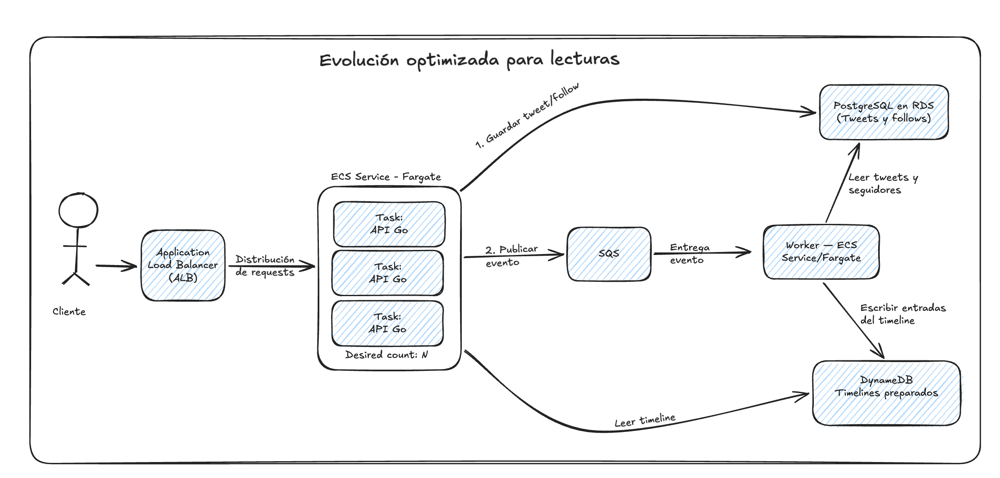

# Architecture

## Objetivo

La aplicación implementa una versión simplificada de una plataforma de
microblogging.

Permite:

- Publicar tweets
- Seguir usuarios
- Consultar un timeline con los tweets de los usuarios seguidos

La consigna indica que la aplicación debe estar optimizada para lecturas y
pensada para millones de usuarios. Sin embargo, no define volúmenes de tráfico,
cantidad de usuarios seguidos, latencia esperada ni un read/write ratio.

Por eso se elige una solución simple para el alcance del challenge y se dejan
documentadas sus limitaciones. Si existieran métricas reales, las decisiones
podrían volver a evaluarse.

## Arquitectura productiva propuesta

La implementación entregada utiliza repositorios en memoria para simplificar la
ejecución del challenge. También utiliza fan-out en lectura: el timeline se
construye cuando el usuario lo consulta combinando los tweets de las cuentas que
sigue.

A continuación se describe una primera versión productiva y una posible evolución
si las métricas muestran que la lectura del timeline se convierte en un cuello de
botella.

Los componentes mencionados en esta sección forman parte del diseño propuesto y
no están incluidos en la implementación actual.

### Primera etapa productiva

Para una primera versión productiva mantendría una arquitectura simple:

- La API Go empaquetada en Docker.
- La aplicación ejecutándose en AWS ECS Fargate.
- Un Application Load Balancer distribuyendo las solicitudes.
- PostgreSQL en AWS RDS como base de datos.
- Fan-out en lectura para construir el timeline.

No agregaría inicialmente colas, workers ni otra base de datos porque la consigna
no proporciona métricas concretas que justifiquen esa complejidad.



#### Ejecución de la aplicación

Mantendría la API como una aplicación Go empaquetada en Docker, igual que en la
implementación entregada.

La ejecutaría en ECS Fargate, que permite correr contenedores sin administrar
directamente los servidores donde se ejecutan. Es un modelo similar al que
utilicé con Fury, donde la infraestructura estaba abstraída y el equipo se
concentraba principalmente en desarrollar y configurar la aplicación.

Delante de la aplicación utilizaría un Application Load Balancer. Su función
sería recibir las solicitudes HTTP y distribuirlas entre las distintas tasks de
la API.

Las tasks no guardarían datos localmente. Una solicitud puede ser atendida por
cualquier instancia y estas pueden crearse, reemplazarse o eliminarse según la
demanda.

Si aumenta el tráfico, se pueden levantar más tasks. Si disminuye, se puede
reducir su cantidad. La persistencia queda fuera de los contenedores para evitar
la pérdida de información cuando una instancia es reemplazada.

#### Base de datos

Para esta etapa utilizaría PostgreSQL mediante AWS RDS.

Elegí una base relacional porque los datos tienen una estructura definida y
existen reglas que conviene garantizar desde la base. Por ejemplo, una relación
de seguimiento no debe estar duplicada y un usuario no puede seguirse a sí
mismo.

PostgreSQL permite guardar tweets y relaciones de seguimiento, aplicar
restricciones de integridad, ordenar los resultados y utilizar paginación por
cursor.

PostgreSQL sería la fuente de verdad:

- La tabla `tweets` contiene los tweets originales.
- La tabla `follows` contiene las relaciones de seguimiento.

RDS permite usar PostgreSQL sin administrar directamente la infraestructura
donde se ejecuta. La aplicación continúa conectándose a una base PostgreSQL
normal, mientras que tareas operativas como backups y reemplazo de
infraestructura pueden quedar administradas por AWS.

No elegiría una base KVS solamente por la cantidad esperada de usuarios. Una KVS
escala bien los accesos por clave, pero requiere diseñar el almacenamiento
alrededor de consultas específicas y no resuelve por sí sola la combinación de
tweets de varios autores.

#### Timeline en la primera etapa

En esta etapa mantendría el fan-out en lectura utilizado por la implementación.

Cuando un usuario consulta su timeline, la aplicación:

1. Busca en PostgreSQL los usuarios que sigue.
2. Busca los tweets publicados por esos usuarios.
3. Combina y ordena los resultados.
4. Aplica la paginación por cursor.
5. Devuelve la página solicitada.

Esta estrategia mantiene simple la publicación de tweets y evita duplicar datos.
También permite que los tweets anteriores de una cuenta aparezcan
automáticamente después de seguirla.

Su principal limitación es que el costo de lectura aumenta con la cantidad de
cuentas seguidas y con el volumen de tweets que se debe combinar.

Antes de cambiar la estrategia mediría:

- Latencia del endpoint de timeline.
- Cantidad de usuarios seguidos por usuario.
- Relación entre lecturas y publicaciones.
- Cantidad de tweets analizados por consulta.
- Uso de CPU y conexiones de PostgreSQL.
- Planes de ejecución de las consultas.

### Evolución optimizada para lecturas

Si las métricas muestran que construir el timeline en cada consulta es el
principal cuello de botella, evolucionaría hacia timelines materializados.

Un timeline materializado es una vista preparada previamente para cada usuario.
El trabajo de combinar los tweets se realiza después de una publicación, en
lugar de repetirse cada vez que alguien consulta su timeline.

Para esta evolución agregaría:

- AWS SQS para comunicar trabajos pendientes.
- Workers ejecutados en ECS Fargate.
- DynamoDB para almacenar los timelines materializados.

PostgreSQL continuaría siendo la fuente de verdad. DynamoDB no reemplazaría a
PostgreSQL ni se utilizaría solamente como cache. Guardaría una vista durable y
reconstruible, preparada específicamente para leer el timeline.



#### Publicación de un tweet

El flujo de publicación sería:

1. La API guarda el tweet original en PostgreSQL.
2. La API envía a SQS un evento que indica que el tweet fue creado.
3. La API confirma la publicación sin esperar la actualización de todos los
   timelines.
4. Un worker recibe el evento desde SQS.
5. El worker consulta en PostgreSQL los seguidores del autor.
6. El worker agrega el tweet al timeline de cada seguidor en DynamoDB.

El worker consulta PostgreSQL porque allí se encuentran los tweets originales y
las relaciones de seguimiento. Escribe en DynamoDB porque allí se encuentran
las vistas preparadas para la lectura.

Esta estrategia se conoce como fan-out en escritura: se realiza más trabajo
después de publicar para reducir el trabajo necesario al leer.

#### Lectura del timeline

Cuando un usuario consulta su timeline:

1. La solicitud llega a la API.
2. La API consulta en DynamoDB el timeline preparado para ese usuario.
3. DynamoDB devuelve las primeras entradas según el límite y el cursor.
4. La API devuelve el resultado al cliente.

Este es el flujo principal para los timelines materializados. Si se utiliza la
estrategia híbrida, la API también consulta los tweets recientes de las cuentas
masivas y los combina con los resultados de DynamoDB. Esto aumenta la
complejidad del orden y la paginación.

En DynamoDB utilizaría:

```text
Partition Key = owner_id
Sort Key      = created_at#tweet_id
```

La clave de partición agrupa las entradas del timeline de un usuario. La clave
de ordenamiento permite obtenerlas desde la más reciente y continuar la
paginación mediante un cursor.

Como el alcance del challenge no permite editar ni eliminar tweets, cada entrada
podría contener los datos necesarios para responder directamente:

- `tweet_id`
- `author_id`
- `content`
- `created_at`

Esto duplica información de forma intencional para favorecer las lecturas y
evitar una consulta adicional a PostgreSQL.

#### Creación de una relación de seguimiento

Con timelines materializados, al crear una relación:

1. La API guarda el follow en PostgreSQL.
2. La API envía un evento a SQS.
3. Un worker obtiene una cantidad limitada de tweets recientes del usuario
   seguido.
4. El worker los agrega al timeline del nuevo seguidor en DynamoDB.

Esto introduce una diferencia respecto de la implementación actual, donde todo
el historial anterior puede consultarse mediante paginación. En una evolución
productiva, la disponibilidad del historial más antiguo y el mecanismo para
consultarlo deberían definirse según los requisitos del producto.

#### Índice para obtener seguidores

En la implementación actual solamente se necesita consultar a quién sigue un
usuario. Para ese patrón de acceso alcanza con la clave primaria:

```text
PRIMARY KEY (follower_id, followed_id)
```

En la evolución con fan-out en escritura aparece un nuevo patrón de acceso:
cuando se publica un tweet, el worker necesita obtener todos los seguidores del
autor.

Para resolver esa consulta agregaría el siguiente índice:

```sql
CREATE INDEX idx_follows_followed_id_follower_id
    ON follows (followed_id, follower_id);
```

Este índice no es necesario para la implementación actual. Se incorpora como
consecuencia de materializar los timelines mediante fan-out en escritura.

#### Eventos procesados

Los workers procesarían principalmente dos tipos de eventos:

- `TweetCreated`: obtiene los seguidores del autor y agrega el tweet al timeline
  materializado de cada uno.
- `FollowCreated`: obtiene una cantidad limitada de tweets recientes del usuario
  seguido y los agrega al timeline del nuevo seguidor.

El procesamiento de `FollowCreated` permite mantener parcialmente la regla del
challenge según la cual los tweets publicados antes del follow también aparecen
en el timeline. En la evolución no se copiaría todo el historial, sino una
cantidad limitada de tweets recientes.

#### Consistencia eventual

La actualización de los timelines sería asíncrona. Un tweet podría estar
guardado y confirmado, pero tardar algunos segundos en aparecer en los
timelines de los seguidores.

Esto no implica perder el tweet. El dato original ya está almacenado en
PostgreSQL. El timeline es una vista derivada que puede actualizarse después y
reconstruirse si fuera necesario.

#### Reintentos e idempotencia

SQS puede entregar un mismo mensaje más de una vez. Por eso el worker debe ser
idempotente: procesar nuevamente el evento no debe crear una entrada duplicada.

La combinación de `owner_id` y `created_at#tweet_id` identifica de forma única
cada entrada del timeline. Repetir la escritura deja el mismo estado final.

#### Usuarios con millones de seguidores

El fan-out en escritura puede ser demasiado costoso para un autor con millones
de seguidores.

En ese caso utilizaría una estrategia híbrida:

- Para autores con una cantidad moderada de seguidores, fan-out en escritura.
- Para autores con una cantidad masiva de seguidores, fan-out en lectura.
- Al consultar el timeline, la aplicación combina el timeline materializado con
  los tweets recientes de esas cuentas masivas.

#### Disponibilidad y observabilidad

La API y los workers podrían tener varias tasks y escalar horizontalmente. El
balanceador enviaría tráfico solamente a instancias saludables mediante health
checks.

Como mínimo observaría:

- Cantidad y latencia de requests.
- Porcentaje de respuestas con error.
- Uso de CPU y memoria de la API.
- Errores y duración del procesamiento de los workers.

También utilizaría logs estructurados con un identificador que permita seguir
una operación entre la API y los workers.

PostgreSQL debería contar con backups y un procedimiento de recuperación. Los
timelines almacenados en DynamoDB son datos derivados y podrían reconstruirse
desde los tweets y follows de PostgreSQL.

### Resumen de la evolución

La arquitectura no comenzaría con todos estos componentes desde el primer día.

La primera etapa productiva utilizaría PostgreSQL y fan-out en lectura porque es
más simple y coincide con la implementación entregada.

Si las métricas muestran que la lectura del timeline no cumple con la latencia o
el volumen esperado, agregaría SQS, workers y timelines materializados en
DynamoDB.

De esta manera, la complejidad se incorpora para resolver un problema medido y
no solamente para anticipar una escala sobre la que no existen datos concretos.

## Modelo de dominio

El modelo conceptual contiene tres entidades: `User`, `Tweet` y `Follow`.

### User

Representa al usuario que publica tweets, sigue a otros usuarios y puede ser
seguido.

`User` es una entidad externa para este servicio. La aplicación recibe
identificadores de usuario válidos, pero no administra su registro ni su ciclo
de vida.

Por este motivo, `User` forma parte del modelo conceptual, pero no se guarda en
este servicio.

### Tweet

Contiene:

- `tweet_id`
- `author_id`
- `content`
- `created_at`

Cada tweet pertenece a un usuario y un usuario puede publicar muchos tweets.

`tweet_id` y `created_at` son generados por el servidor.

### Follow

Contiene:

- `follower_id`: usuario que sigue
- `followed_id`: usuario seguido

Representa una relación dirigida muchos-a-muchos entre usuarios.

## Modelo de persistencia

El servicio guarda solamente `Tweet` y `Follow`.

Los campos:

- `Tweet.author_id`
- `Follow.follower_id`
- `Follow.followed_id`

son referencias lógicas a `User`, pero no son claves foráneas hacia una tabla
local.

La aplicación no verifica la existencia de los usuarios. Esto es aceptable
porque la consigna indica que todos los identificadores recibidos se consideran
válidos.

### Restricciones de Follow

La combinación:

```text
(follower_id, followed_id)
```

debe ser única para evitar relaciones duplicadas y permitir que seguir a un
usuario sea una operación idempotente.

También debe cumplirse:

```text
follower_id != followed_id
```

para impedir que un usuario se siga a sí mismo.

## Patrones de acceso

### Publicar un tweet

Entrada recibida:

- `author_id`
- `content`

Valores generados por el servidor:

- `tweet_id`
- `created_at`

Operación:

- Insertar un nuevo `Tweet` asociado al identificador del autor.

### Seguir a un usuario

Entrada:

- `follower_id`
- `followed_id`

Operación:

- Insertar un nuevo `Follow`.
- Si la relación ya existe, la operación termina correctamente sin crear un
  duplicado.
- Si ambos identificadores son iguales, la operación se rechaza.

### Obtener el timeline

Entrada:

- `user_id`
- Límite de resultados
- Cursor para las páginas posteriores

Recorrido:

1. Buscar los `followed_id` correspondientes al usuario.
2. Buscar los tweets publicados por esos usuarios.
3. Combinar los resultados.
4. Ordenarlos por:

```text
created_at DESC, tweet_id DESC
```

5. Devolver una cantidad limitada.

## Estrategia del timeline

Se utiliza fan-out en lectura.

El timeline se construye cuando el usuario lo consulta y no se guarda como una
entidad independiente.

Esta estrategia evita agregar duplicación de datos y procesamiento adicional al
publicar un tweet.

Como trade-off, el costo de lectura aumenta cuando un usuario sigue a muchas
cuentas, porque es necesario buscar y combinar tweets de varios autores.

Si las métricas mostraran problemas de latencia, se podría evaluar fan-out en
escritura o una estrategia híbrida.

## Orden del timeline

Los tweets se ordenan por:

```text
created_at DESC, tweet_id DESC
```

`created_at` define el orden desde el tweet más reciente hasta el más antiguo.

Si dos tweets tienen el mismo `created_at`, se utiliza `tweet_id` como desempate.
Esto permite mantener un orden determinista y evita que los tweets cambien de
posición entre consultas con los mismos datos.

## Paginación

El timeline utiliza paginación por cursor, también conocida como keyset
pagination.

El tamaño predeterminado de página es 20 y el máximo permitido es 100.

El cursor representa la posición del último tweet devuelto y contiene
lógicamente:

```text
created_at + tweet_id
```

Se utilizan ambos valores porque coinciden con el orden definido para el
timeline. Usar solamente `created_at` podría hacer que se omitan tweets cuando
varios tengan la misma fecha.

### Primera página

Para la primera página no se recibe un cursor. Conceptualmente, la consulta es:

```sql
WHERE author_id IN (:followed_ids)
ORDER BY created_at DESC, tweet_id DESC
LIMIT :page_size_plus_one
```

### Páginas siguientes

Para obtener una página siguiente se buscan los tweets más antiguos que se
encuentran después de la posición indicada por el cursor:

```sql
WHERE author_id IN (:followed_ids)
  AND (
      created_at < :cursor_created_at
      OR (
          created_at = :cursor_created_at
          AND tweet_id < :cursor_tweet_id
      )
  )
ORDER BY created_at DESC, tweet_id DESC
LIMIT :page_size_plus_one
```

La consulta representa el comportamiento esperado. La sintaxis concreta puede
cambiar según la base de datos elegida.

### Representación del cursor

El cursor se devuelve al cliente como un valor opaco. Aunque internamente
represente `created_at` y `tweet_id`, el cliente no necesita conocer su
estructura.

Esto permite cambiar su formato interno sin modificar el contrato de la API.

### Detección de la página siguiente

Se consultan `page_size + 1` tweets:

- Se devuelven como máximo `page_size`.
- Si existe un elemento adicional, se genera `next_cursor`.
- Si no existe un elemento adicional, `next_cursor` queda vacío.

De esta forma se puede saber si existe otra página sin realizar una consulta
adicional.

### Nuevos tweets durante la paginación

Si se publica un tweet entre la primera página y la siguiente, normalmente
quedará antes del cursor y no desplazará los resultados de las páginas
posteriores.

Para ver los tweets nuevos, el cliente debe volver a solicitar la primera
página.

Esta estrategia permite una navegación estable, pero no representa una
fotografía inmutable del timeline completo.

## Índices

Los índices se definen a partir de los patrones de acceso acordados.

### Tweet

```text
PRIMARY KEY (tweet_id)
INDEX (author_id, created_at DESC, tweet_id DESC)
```

La clave primaria identifica cada tweet.

El índice compuesto permite:

- Buscar los tweets publicados por cada usuario seguido.
- Recorrer los tweets de cada autor desde el más reciente hasta el más antiguo.
- Desempatar mediante `tweet_id`.
- Aplicar la paginación por cursor.

La base de datos todavía debe combinar los tweets de los distintos autores para
construir el orden global del timeline. Esto es una consecuencia esperada del
fan-out en lectura.

No se agrega un índice independiente por `author_id`, porque ya es la primera
columna del índice compuesto.

### Follow

```text
PRIMARY KEY (follower_id, followed_id)
```

La clave primaria compuesta cumple dos objetivos:

- Evita relaciones duplicadas.
- Permite obtener eficientemente los usuarios seguidos porque `follower_id` es
  la primera columna.

No se agrega un índice por `followed_id`, porque consultar quiénes siguen a un
usuario no es un patrón de acceso requerido por el challenge.

## Persistencia para un entorno productivo

Para simplificar la ejecución del challenge, la implementación actual utiliza
repositorios en memoria.

Esta decisión permite ejecutar la aplicación sin infraestructura adicional, pero
los datos se pierden cuando el proceso se reinicia. Tampoco busca resolver
durabilidad, replicación ni escalado horizontal.

Para una primera versión productiva elegiría PostgreSQL.

### Por qué PostgreSQL

El modelo tiene relaciones y restricciones claras:

- Cada tweet pertenece a un autor.
- Un usuario puede seguir a varios usuarios.
- La relación `(follower_id, followed_id)` debe ser única.
- Un usuario no puede seguirse a sí mismo.
- El timeline consulta tweets de varios autores y necesita un orden global.

PostgreSQL se utilizaría como persistencia principal de toda la aplicación,
tanto para los tweets como para las relaciones de seguimiento.

Permite representar las reglas del modelo mediante claves primarias,
restricciones e índices compuestos. También permite mantener la idempotencia de
los follows y consultar el timeline utilizando joins y paginación por cursor.

Se elige una base relacional porque los datos tienen una estructura estable y
las relaciones forman parte importante de los patrones de acceso.

Una base NoSQL podría ser apropiada si el timeline estuviera previamente
materializado o si existieran requisitos concretos de distribución y volumen.
Sin embargo, para el fan-out en lectura actual probablemente sería necesario
consultar por separado los tweets de cada autor y combinarlos en la aplicación.

Como no se definieron volúmenes, latencia esperada ni un read/write ratio, no
agregaría esa complejidad sin métricas que la justifiquen.

### Esquema conceptual

```sql
CREATE TABLE tweets (
    tweet_id UUID PRIMARY KEY,
    author_id TEXT NOT NULL,
    content TEXT NOT NULL,
    created_at TIMESTAMPTZ NOT NULL,
    CHECK (char_length(content) BETWEEN 1 AND 280)
);

CREATE INDEX idx_tweets_author_timeline
    ON tweets (
        author_id,
        created_at DESC,
        tweet_id DESC
    );
```

```sql
CREATE TABLE follows (
    follower_id TEXT NOT NULL,
    followed_id TEXT NOT NULL,
    PRIMARY KEY (follower_id, followed_id),
    CHECK (follower_id <> followed_id)
);
```

No se crea una tabla de usuarios porque la consigna considera válidos todos los
identificadores recibidos y deja fuera de alcance su administración.

### Consultas principales

#### Publicar un tweet

```sql
INSERT INTO tweets (
    tweet_id,
    author_id,
    content,
    created_at
)
VALUES ($1, $2, $3, $4);
```

#### Seguir a un usuario

```sql
INSERT INTO follows (
    follower_id,
    followed_id
)
VALUES ($1, $2)
ON CONFLICT (follower_id, followed_id) DO NOTHING
RETURNING follower_id;
```

Si devuelve una fila, la relación fue creada.

Si no devuelve filas, la relación ya existía. De esta manera se mantiene la
idempotencia del endpoint.

#### Obtener los usuarios seguidos

```sql
SELECT followed_id
FROM follows
WHERE follower_id = $1;
```

La clave primaria `(follower_id, followed_id)` permite buscar por
`follower_id` sin agregar otro índice.

#### Primera página del timeline

```sql
SELECT
    t.tweet_id,
    t.author_id,
    t.content,
    t.created_at
FROM follows AS f
JOIN tweets AS t
    ON t.author_id = f.followed_id
WHERE f.follower_id = $1
ORDER BY
    t.created_at DESC,
    t.tweet_id DESC
LIMIT $2;
```

El límite utilizado es `page_size + 1` para determinar si existe una página
siguiente.

#### Páginas siguientes

```sql
SELECT
    t.tweet_id,
    t.author_id,
    t.content,
    t.created_at
FROM follows AS f
JOIN tweets AS t
    ON t.author_id = f.followed_id
WHERE f.follower_id = $1
  AND (
      t.created_at < $2
      OR (
          t.created_at = $2
          AND t.tweet_id < $3
      )
  )
ORDER BY
    t.created_at DESC,
    t.tweet_id DESC
LIMIT $4;
```

Los parámetros `$2` y `$3` representan la posición incluida en el cursor. La
comparación es exclusiva para evitar repetir el último tweet de la página
anterior.

### Escalabilidad y evolución

El costo del fan-out en lectura aumenta cuando un usuario sigue a muchas
cuentas, porque PostgreSQL debe combinar tweets de varios autores para construir
el orden global.

Antes de cambiar la estrategia mediría:

- Cantidad promedio de usuarios seguidos.
- Frecuencia de lectura y escritura.
- Latencia del timeline.
- Cantidad de tweets recorridos.
- Planes de ejecución de las consultas.

Si las métricas mostraran problemas, se podría evaluar una estrategia de
fan-out en escritura o una solución híbrida. Esas alternativas agregarían
duplicación de datos y procesamiento adicional, por lo que quedan fuera del
alcance actual.

## Limitaciones conocidas

- El costo de obtener el timeline crece con la cantidad de usuarios seguidos.
- La base de datos debe combinar tweets de varios autores para construir el
  orden global.
- La existencia de los usuarios no se puede verificar localmente.
- No se definieron volúmenes de tráfico ni objetivos concretos de latencia.
- No se definió una cantidad máxima de cuentas seguidas por usuario.
- La paginación no representa una fotografía inmutable del timeline.
- Los índices deberían validarse con métricas y planes de ejecución en un
  entorno real.